# AKS .Net Core playground - Kubernetes (AKS), VSTS, ACR, helm

This demo contains helm templates and description of k8s use-cases which can be used with .Net Core dockerized services (linux based containers).

## Prerequisites
* you have to be familiar with VSTS and Visual Studio 2017
* Windows 10 
 * Visual Studio 2017
 * installed "Bash on Ubuntu on Windows"
 * installed docker for windows
 * installed Azure CLI in Bash on Ubuntu - https://docs.microsoft.com/en-us/cli/azure/install-azure-cli-apt?view=azure-cli-latest 
 * installed helm in Bash on Ubuntu on Windows" - https://github.com/kubernetes/helm/blob/master/docs/install.md 

## Demonstrated scenario:
* automatically create infrastructure environment AKS (kubernetes), ACR.
* deploy nginx-ingerss controller to kubernetes cluster for future use

### Solution can be provisioned by this simple script from Azure Cloud Shell:
* **prerequisites**
 * you need your SSH (private and public) key prepared in cloud shell (description how to generate keys: https://help.github.com/articles/generating-a-new-ssh-key-and-adding-it-to-the-ssh-agent/#platform-linux )
 * public ssh key is in file `~/.ssh/id_rsa.pub` 
* run Azure Cloud Shell
* 
* There run install script and provide necessary parameters
* `curl -s https://raw.githubusercontent.com/valda-z/aks-netcore-playground/master/run.sh | bash -s -- --resource-group KUBE --kubernetes-name valdakube `
* supported parameters are:
 * Mandatory
     * `--resource-group` - Azure resource group name (will be created by script)
     * `--kubernetes-name` - Unique name for kubernetes cluster 
 * Optional (if not provided than script uses defaults - see script)
     * `--location` - Azure region for resource group and all resources 

### After successful deployment:
* deployment script will show necessary information how to access our micro-service application

There is sample output - please store DNS name for service [APP DNS NAME]:

```
### DONE
### URL for your application is http://valdaaks02-6de04cb8.westeurope.cloudapp.azure.com after deployment

```

## Experiments

### #1 Deploy Replica Set and Service

#### create dockercloud replicaset and service

Create and validate replica set with simple http service and then create service with external load balancer and public IP address.
ReplicaSet and Service can be created by scripts or directly from Kubernetes control plane.

##### dp-rs.yaml
```yaml
apiVersion: extensions/v1beta1
kind: ReplicaSet
metadata:
  name: dockercloud
spec:
  replicas: 2
  template:
    metadata:
      labels:
        app: dockercloud
    spec:
      containers:
        - name: hostname
          image: dockercloud/hello-world
          resources:
            requests:
              cpu: 100m
              memory: 100Mi
```

##### dp-svc.yaml
```yaml
apiVersion: v1
kind: Service
metadata:
  labels:
    app: dockercloud
  name: dockercloud
spec:
  ports:
  - port: 80
    protocol: TCP
    targetPort: 80
    name: http
  selector:
    app: dockercloud
  type: LoadBalancer
```

##### run commands ..

`kubectl create -f dp-rs.yaml`

`kubectl create -f dp-svc.yaml`

Or you can use kubernetes control plane for creating replicaset and service

##### wait for provisioning of services

You can check status of provisioning by running command (or you can use kubernetes control plane for it):

`kubectl get svc`

### #2 Create ASP.NET Core Web Application in Linux Docker

#### Create new project
* Use new project, select type "ASP.NET Core Web Application"
* In project detail page select "ASP.NET Core 2.0" and project type "API"
* Open Controller in your project and change Get method to return some environment variable:

```cs
[HttpGet("{id}")]
public string Get(int id)
{
    return Environment.GetEnvironmentVariable("MYTESTENVIRONMENT");
}
```
* Insight your Controller create method to handle default path "/" - kubernetes will use this entrypoint for health probe.

```cs
[HttpGet]
[Route("/")]
public string Probe()
{
    return "OK";
}
```

* build and test project (also you can test setting environment variable `MYTESTENVIRONMENT` for project

#### Enable docker support for project
* Select "Docker support" from "Project" menu
* Select type "Linux"
* Visual Studio will create for you dockerfile and now you can build and debug your application in running docker (select right target for debug).

#### Publish docker image to Azure Container Registry

##### Visual Studio 2017
* Select "Publish" option on project
* Create new publishing profile for Container Registry and select your existing Azure Container Registry in your subscription
* Publish image


##### Alternative process from command line
* Create tag on your docker image, first of all list images by `docker images` and than `docker tag [YOUR APP IMAGE] [YOUR REGISTRY NAME].azurecr.io/[YOUR APP IMAGE]`
* login to container registry `docker login [YOUR REGISTRY NAME].azurecr.io -u xxxxxxxx-xxxx-xxxx-xxxx-xxxxxxxxxxxx -p myPassword` - credentials for registry are visible in Azure Portal.
* push image to registry `docker push [YOUR REGISTRY NAME].azurecr.io/[YOUR APP IMAGE]`

### #3 install application and configure security configmap

#### Create secrets for application
Create secrets from kubectl command line, secret name and secret keys correlates to  helm chrt for our app:

`kubectl create secret generic myrelease-mynetcoreapp --from-literal=mytestenvironment="My supersecret string"`

#### install application with helm
Download helm chart directory from https://github.com/valda-z/aks-netcore-playground.

Run following command to install application from directory where chart directory is located.

`helm upgrade --install --wait myrelease mynetcoreapp --set-string imagePullSecrets='[YOUR REGISTRY NAME].azurecr.io',image.repository='[YOUR REGISTRY NAME].azurecr.io/[YOUR APP IMAGE]',image.tag='[BUILDNUMBER]',track=stable,branchName='master',branchSubdomain='',ingress.host='[APP DNS NAME]' --namespace='default'`

Or on Windows CMD (to use external LoadBalancer):
`helm upgrade --install --wait myrelease mynetcoreapp --set-string imagePullSecrets="######.azurecr.io",image.repository="######.azurecr.io/#######",image.tag="######",track=stable,branchName="master",branchSubdomain="",service.type=LoadBalancer,ingress.enabled=false --namespace=default`

Now we can test our api on URL:

http://[APP DNS NAME]/myapi1/values/1

Clean-up deployment after tests..

`helm del --purge myrelease` 

### #4 VSTS CI/CD pipeline

#### Create CI pipeline

* Create new project in VSTS and connect there your source code
* push sources to VSTS git
* Create New Build in VSTS 
 * New build type "APS.NET Core"
 * Define Variable `DOCKER_REGISTRY` - value is empty (to avoid warnings and errors) 
 * 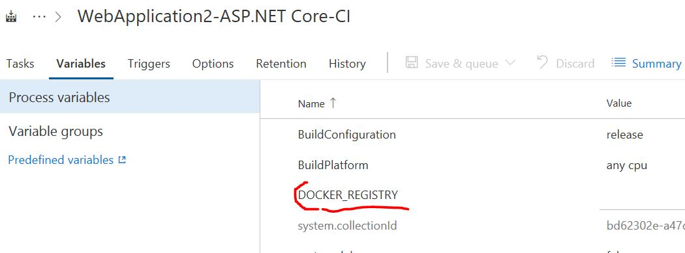
 * Go to project properties (Process) and select Agent type "Hosted Linux Preview"
 * 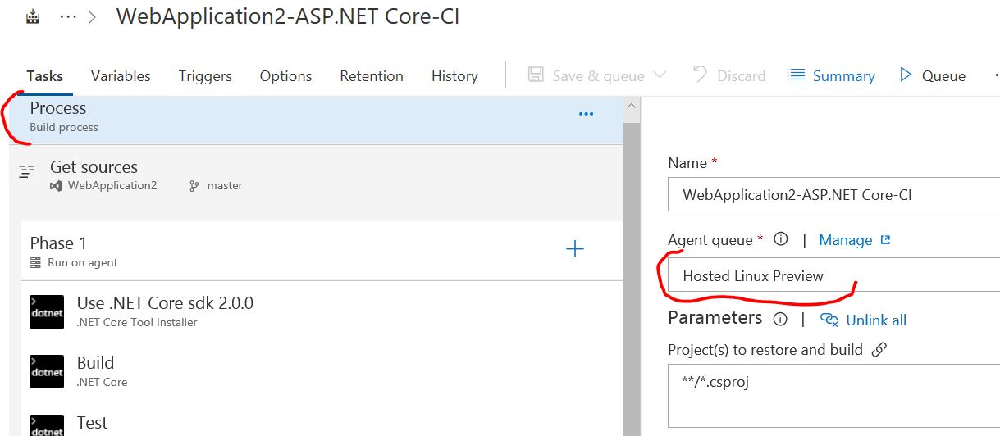
 * Remove the Restore task because .NET Core 2 restores during the build already
 * Add "Net Core Tools Installer", set version 2.0.0
 * 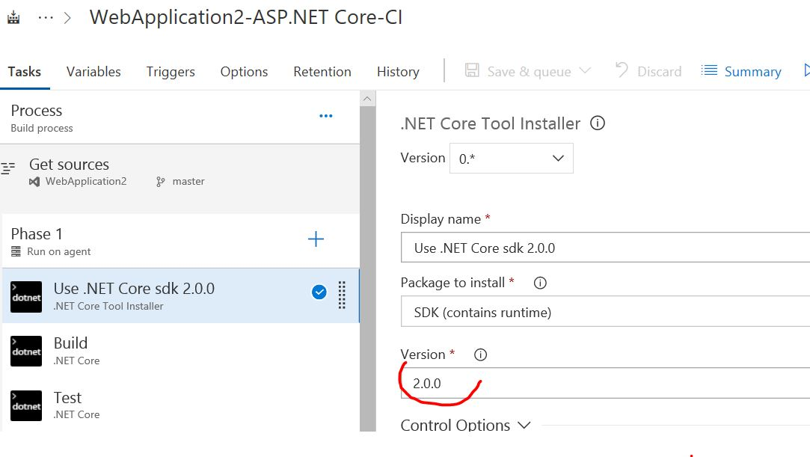
 * Select the Publish task, by default the output is configured as follows: –output $(build.artifactstagingdirectory). Our Dockerfile expects the sources by default on “obj/Docker/publish”, change the output to: `.\obj\Docker\publish`
 * 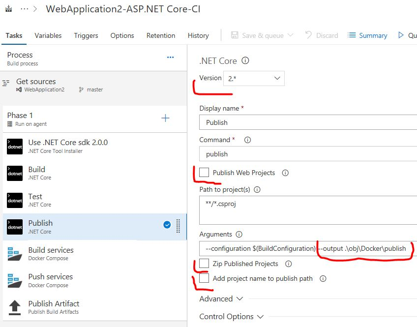
 * Add task type "Docker Compose" and select "Action" to "Build service images", select your subscription and Azure Container Registry, finally set "Additional Image Tags" to `$(Build.BuildId)`
 * 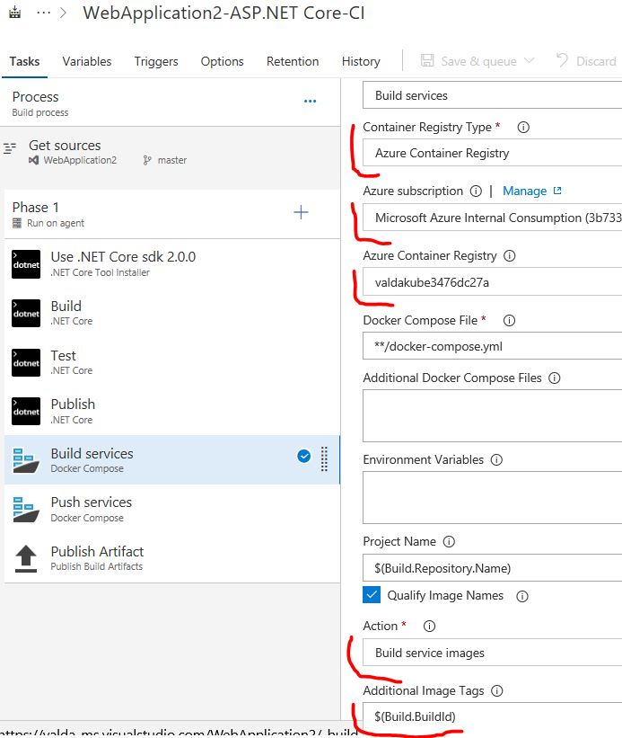
 * Add task type "Docker Compose" and select "Action" to "Push service images", select your subscription and Azure Container Registry, finally set "Additional Image Tags" to `$(Build.BuildId)`
 * 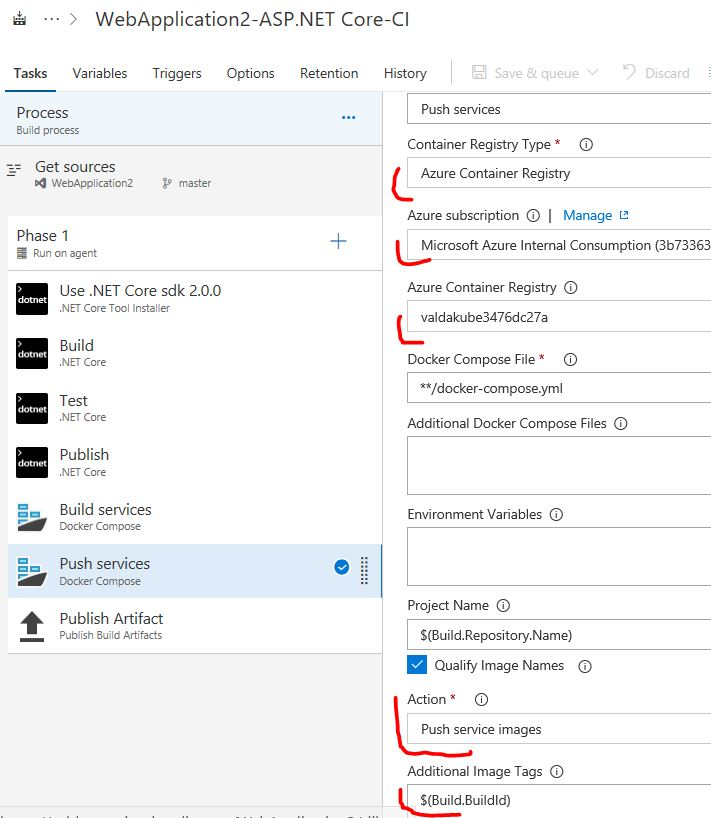

Now you can run build and check if docker image appears in Azure Container Registry.

#### Create CD pipeline

##### update CI pipeline and project

Download helm chart directory from https://github.com/valda-z/aks-netcore-playground and copy it to your project. Commit and push changes ...

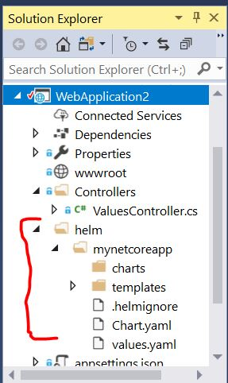

* Open build definition in VSTS
* Go to "Publis Artifacts and set "Path to publish" to location with charts in your project
* Set "Artifact name to "charts"
* 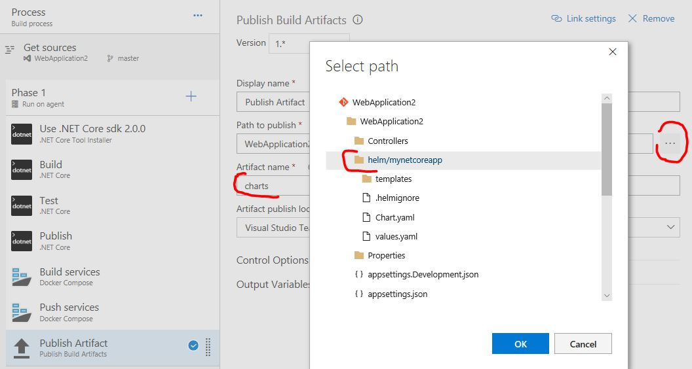

##### New CD pipeline

* Create new Release in VSTS, you can use Empty process ..
* Define "Artifacts" pointing to your build process
 * change "Source alias" to `helm` (name of directory where we can see charts)
 * 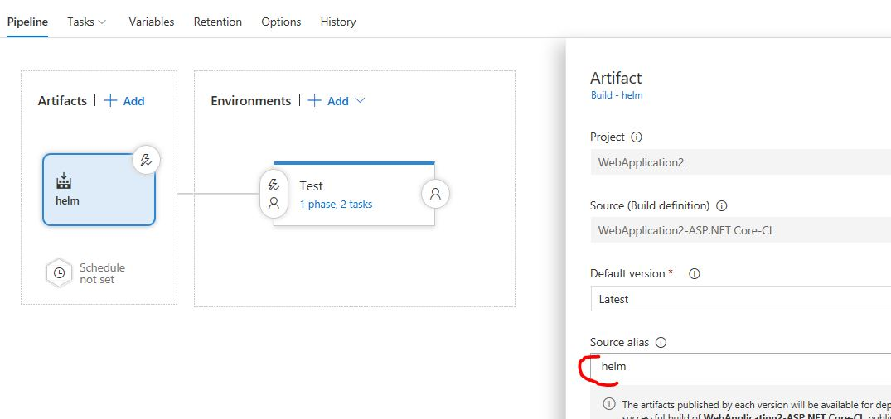
* Enable continuous deployment trigger
* In Environments define one Environment named "Test"
* Go to Task definition for Environment Test
 *  change Agent to "Hosted Linux preview"
 * 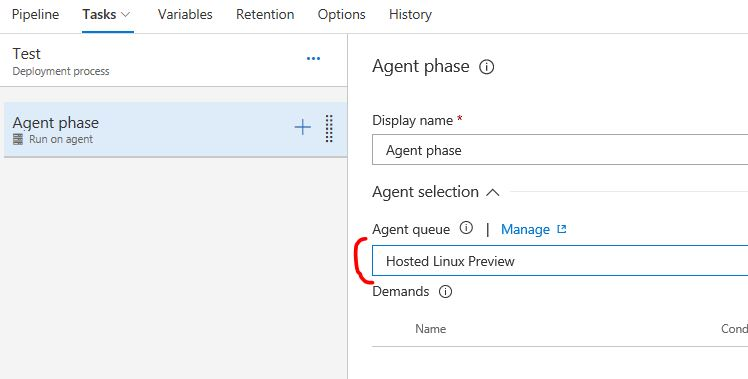
* Include two new tasks for helm (Helm tool installer, Package and deploy Helm charts)
*  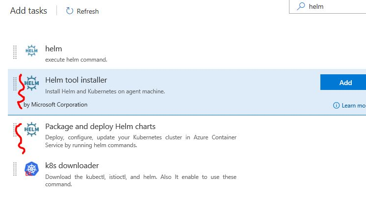
* Configure Helm tool installer - change helm version to 2.9.0
* Configure Package and deploy Helm charts
 * Configure Azure connection to your kubernetes cluster
 * Set "Namespace" to `default'
 * 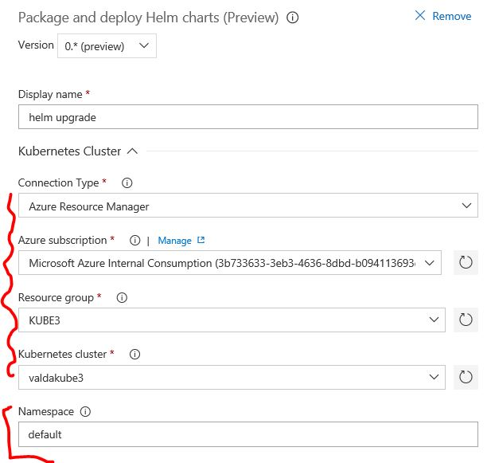
 * Set "Command" to `upgrade`
 * Set "Chart Type" to "Filename and select path to `charts` directory
 * Set "Release name" - `myrelease
 * Set field "Set Values" to `imagePullSecrets=[YOUR REISTRY NAME].azurecr.io,image.repository=[Your REGISTRY NAME].azurecr.io/webapplication2,image.tag=$(Build.BuildId),track=stable,branchName=master,ingress.host=[APP DNS NAME]` 
 * 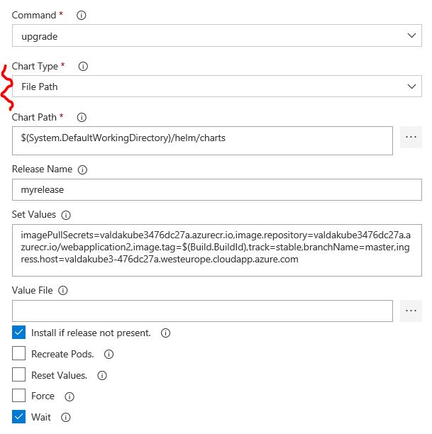 

Now you can check in kubernetes control plane that new version was deployed, also you can try to change something in your code to verify that whole CI/CD pipeline works.

http://[APP DNS NAME]/myapi1/values/1


 
 


 


